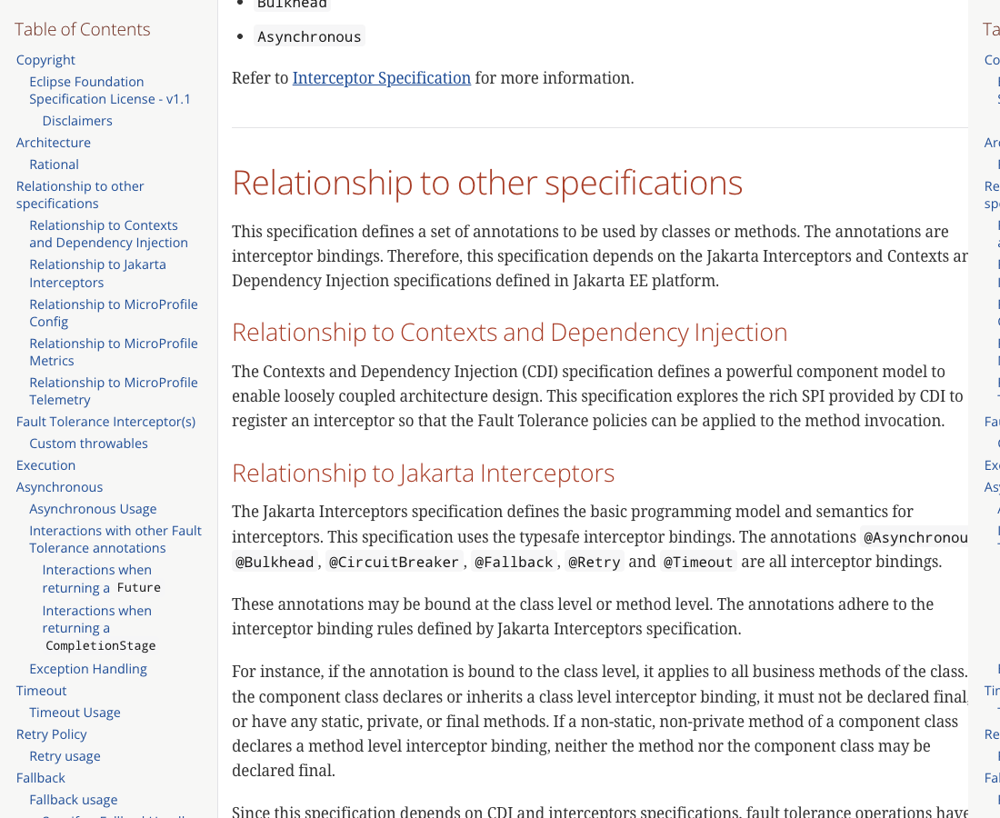
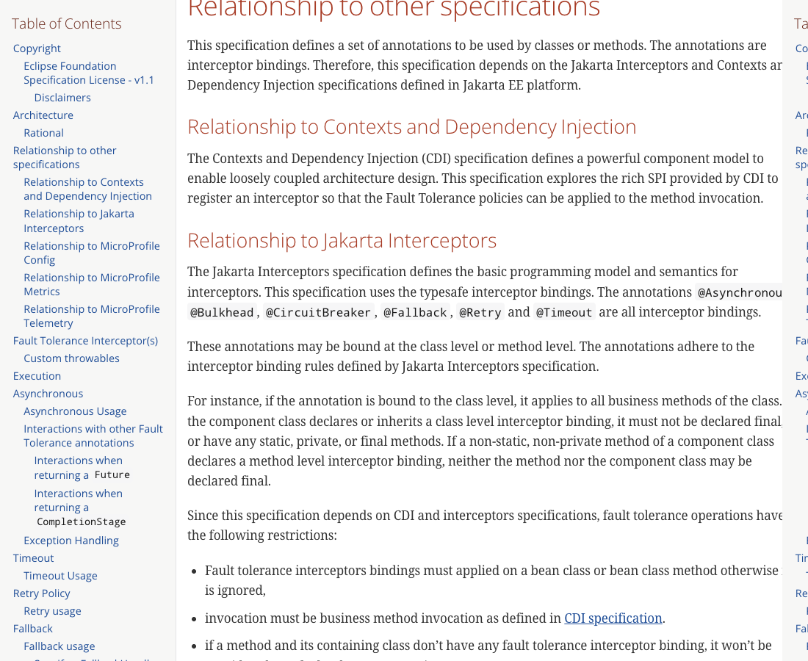
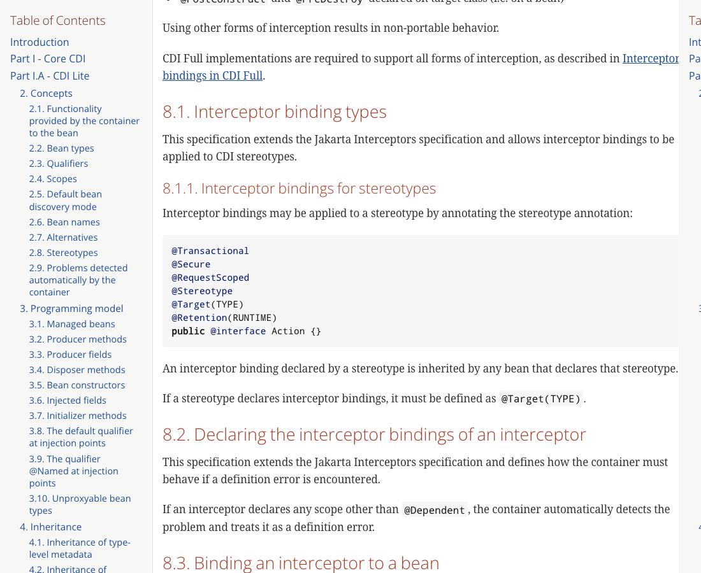
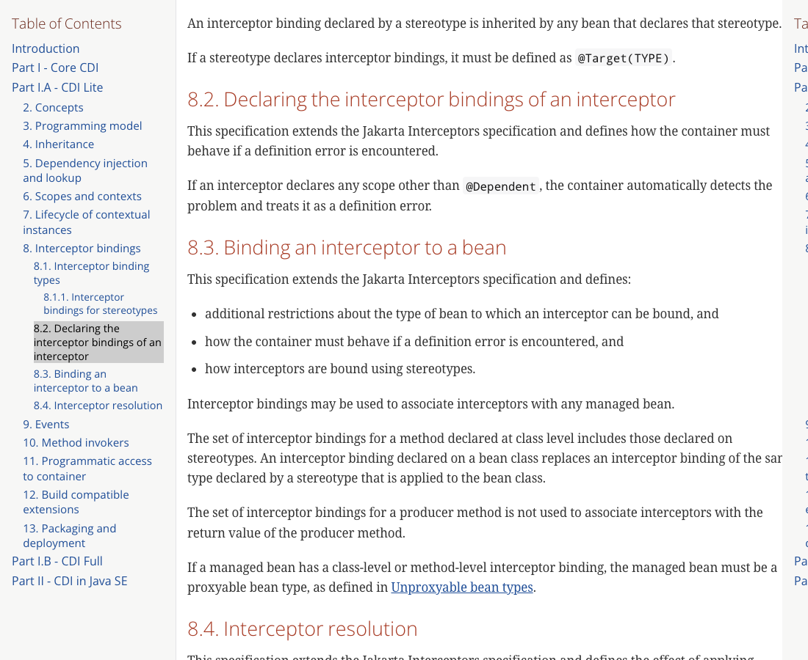

# MicroProfile Fault Tolerance: stereotype portability reproducer

Minimal, self-contained reproducer that checks whether a MicroProfile Fault Tolerance
annotation declared through a CDI `@Stereotype` (at class level) is applied by a given
runtime. It runs the same application on several MicroProfile implementations and reports,
for each one, whether the stereotype-declared annotation engaged.

The reproducer is the practical evidence behind
[eclipse/microprofile-fault-tolerance#187](https://github.com/eclipse/microprofile-fault-tolerance/issues/187)
("Support `@Stereotype`"), open since 2017.

## What it checks

Each runtime exposes four plain-text endpoints under `/api/check`:

1. `GET /api/check` (stereotype): a bean whose `@Retry(maxRetries = 2)` comes ONLY from a
   class-level stereotype. Expected invocation count with retry applied: 3. Observed count
   of 1 means the stereotype-declared annotation was not applied.
2. `GET /api/check/direct` (control): a bean with `@Retry(maxRetries = 2)` declared directly
   on the class. Every runtime is expected to return 3. This positive control proves the
   Fault Tolerance runtime itself works, so a count of 1 on the stereotype endpoint is a
   stereotype-discovery gap and not a broken setup.
3. `GET /api/check/timeout`: a bean whose `@Timeout(500)` comes only from a class-level
   stereotype, calling a method that sleeps 1500 ms. A `TimeoutException` means the
   stereotype-declared `@Timeout` was applied; completing in roughly 1500 ms means it was not.
4. `GET /api/check/conflict`: a bean declaring two stereotypes that each declare `@Retry`
   with a different `maxRetries` (2 and 4). Resolution of conflicting interceptor bindings
   contributed by multiple stereotypes is not defined by the specifications, so this endpoint
   only documents the observed, implementation-specific behaviour.

## Results

Tested on 2026-06-10 with the versions listed below. Every runtime passes the direct control
(3 invocations), which isolates the behaviour to stereotype discovery.

| Runtime | Vendor | FT engine | `@Retry` via stereotype | `@Timeout` via stereotype | Direct control |
|---|---|---|---|---|---|
| Payara 6.2025.11 | Payara | own | applied (3) | applied (TimeoutException) | 3 |
| Open Liberty 26.0.0.5 | IBM | own | not applied (1) | not applied (1504 ms) | 3 |
| Helidon 4.1.6 | Oracle | own | not applied (1) | not applied (1506 ms) | 3 |
| Apache TomEE 10.0.0-M3 | Apache | Geronimo Safeguard | not applied (1) | not applied (1500 ms) | 3 |
| Quarkus 3.15.1 | Red Hat | SmallRye | not applied (1) | not applied (1504 ms) | 3 |
| WildFly 34.0.1.Final | Red Hat | SmallRye | not applied (1) | not applied (1506 ms) | 3 |

Reading of the results: implementations diverge. At least one runtime (Payara) already
applies Fault Tolerance annotations declared via a class-level stereotype, which proves the
behaviour is implementable, while others do not. An application that relies on it behaves
differently across certified runtimes today. This is a specification-clarification
opportunity, not a defect report against any implementation: there is no TCK test that pins
this behaviour yet, so implementations were free to diverge.

### SmallRye fix

The SmallRye Fault Tolerance gap is fixed in
[smallrye/smallrye-fault-tolerance#1276](https://github.com/smallrye/smallrye-fault-tolerance/pull/1276),
merged Jun 12, 2026 into the 7.0.0 milestone. Verified against a patched SmallRye build, the
stereotype endpoint returns 3 (applied). Once SmallRye 7.0.0 is released, the SmallRye-based
runtimes above (Quarkus, WildFly) will apply the stereotype-declared annotation as well.

The conflict endpoint, on a runtime that applies stereotype bindings (Payara), returns 3,
meaning the first declared stereotype (`maxRetries = 2`) wins. This behaviour is
implementation specific and is out of scope for any portable test.

## Relation to issue #187

This reproducer supports
[eclipse/microprofile-fault-tolerance#187](https://github.com/eclipse/microprofile-fault-tolerance/issues/187).
Two questions are open for the working group: whether this behaviour is in scope for the
specification, to be clarified and verified, or intentionally optional; and, if in scope,
whether a small `@Retry` TCK matrix plus a brief clarification in the "Relationship to
Jakarta Interceptors" section would be welcome. The author is happy to follow either
direction.

## Proposed contribution

If the working group considers this in scope, this repository already contains the material to
move quickly:

- `docs/proposed-test-matrix.md`: the proposed `@Retry` TCK matrix (17 tests), with the
  invocation-count breakdown and the empirical SmallRye result.
- `docs/proposed-spec-clarification.md`: a scope statement, a brief draft clarification for
  the "Relationship to Jakarta Interceptors" section anchored on CDI 8.1.1 and 8.3, and a
  backward-compatibility note.

The TCK tests themselves would be submitted as a separate pull request to the
microprofile-fault-tolerance repository once scope is confirmed.

## Why this matters

The verbatim quotes below are taken from the official published specifications. The
accompanying screenshots were captured from those same documents at the canonical URLs listed
under Sources.

The MicroProfile Fault Tolerance specification states that its annotations are interceptor
bindings, and that it depends on Jakarta Interceptors and CDI:

> The annotations `@Asynchronous`, `@Bulkhead`, `@CircuitBreaker`, `@Fallback`, `@Retry` and
> `@Timeout` are all interceptor bindings.
>
> The annotations are interceptor bindings. Therefore, this specification depends on the
> Jakarta Interceptors and Contexts and Dependency Injection specifications defined in Jakarta
> EE platform.

MicroProfile Fault Tolerance 4.1.1, "Relationship to other specifications".



The same section also states that a class-level annotation applies to every business method:

> if the annotation is bound to the class level, it applies to all business methods of the
> class.



Jakarta CDI then defines how interceptor bindings behave on stereotypes:

> An interceptor binding declared by a stereotype is inherited by any bean that declares that
> stereotype.
>
> If a stereotype declares interceptor bindings, it must be defined as `@Target(TYPE)`.

Jakarta CDI 4.1, section 8.1.1.



CDI also defines the precedence that this reproducer exercises, where a class-level annotation
replaces the one contributed by the stereotype:

> The set of interceptor bindings for a method declared at class level includes those declared
> on stereotypes. An interceptor binding declared on a bean class replaces an interceptor
> binding of the same type declared by a stereotype that is applied to the bean class.

Jakarta CDI 4.1, section 8.3.



Compatibility with an Eclipse Foundation specification is defined by its TCK:

> A Compatible Implementation must fulfil all requirements of a Final Specification including
> all requirements of the corresponding TCK.

Eclipse Foundation Specification Process. Compatibility is done via self-certification by
passing the TCK. There is currently no TCK test that exercises Fault Tolerance annotations
declared via a stereotype, which is why the behaviour reported above was never aligned across
implementations.

## Sources

- MicroProfile Fault Tolerance 4.1.1 specification: https://download.eclipse.org/microprofile/microprofile-fault-tolerance-4.1.1/microprofile-fault-tolerance-spec-4.1.1.html
- Jakarta CDI 4.1 specification: https://jakarta.ee/specifications/cdi/4.1/jakarta-cdi-spec-4.1.html
- Eclipse Foundation Specification Process: https://www.eclipse.org/projects/efsp/
- Issue: https://github.com/eclipse/microprofile-fault-tolerance/issues/187
- SmallRye Fault Tolerance fix: https://github.com/smallrye/smallrye-fault-tolerance/pull/1276

## Repository layout

| Path | Runtimes it targets | How it is built |
|---|---|---|
| `app/` | Payara, Open Liberty, Apache TomEE, WildFly | builds `app.war` |
| `quarkus/` | Quarkus | Quarkus fast-jar |
| `helidon/` | Helidon | Helidon MP application |

All modules share the same `com.example` sources: the stereotypes, the beans, and the REST
endpoints. Requires JDK 17 (Helidon requires JDK 21).

## How to reproduce

### app.war on a servlet runtime

```
mvn -f app/pom.xml clean package
```

- Payara Micro: `java -jar payara-micro.jar --deploy app/target/app.war --contextroot /app --port 8090`
- Open Liberty: deploy `app/target/app.war` with the `mpFaultTolerance`, `cdi` and `restfulWS`
  features enabled, then browse `http://localhost:9080/app/api/check`.
- WildFly: copy `app/target/app.war` to `standalone/deployments` and start with
  `standalone-microprofile.xml`, then browse `http://localhost:8080/app/api/check`.
- Apache TomEE (microprofile): `mvn -f app/pom.xml tomee:run` after adding the
  `tomee-maven-plugin`, then browse `http://localhost:8080/app/api/check`.

### Quarkus

```
mvn -f quarkus/pom.xml clean package
java -jar quarkus/target/quarkus-app/quarkus-run.jar
curl http://localhost:8080/api/check
```

### Helidon (JDK 21)

```
mvn -f helidon/pom.xml clean package
java -jar helidon/target/stereotype-portability-helidon.jar
curl http://localhost:7001/api/check
```

For each runtime, compare `/api/check` (stereotype) against `/api/check/direct` (control).

## License

MIT. See `LICENSE`.
